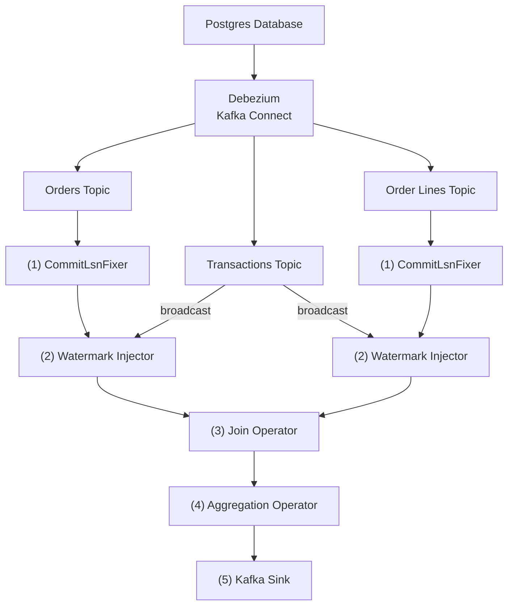

# Towards Transactionally Consistent Change Event Processing With Apache Flink

Apache Flink is commonly used for processing data change event streams--for example, to filter, join, and aggregate data changes from a Postgres or MySQL database, captured and ingested via change data capture (CDC) tools such as Debezium.
Currently, this processing happens on an event-by-event basis without considering the transactional boundaries of the source database.
This can cause Flink to emit incomplete or even incorrect query results.

This document discusses why this is problematic, introduces a proof-of-concept (PoC) for transactionally consistent change event processing with Flink, and discusses what changes will be needed in both Debezium and Flink for implementing a production-ready solution.

## The Problem

Currently, Flink is not aware of any transactional boundaries in the source database.
As an example, consider the following join query:

```sql
SELECT
    po.id,
    po.order_date,
    po.purchaser_id,
    ARRAY_AGG(ROW(ol.id, ol.product_id, ol.quantity, ol.price))
FROM
    purchase_orders po
    LEFT JOIN order_lines ol ON ol.order_id = po.id
GROUP BY
    po.id,
    po.order_date,
    po.purchaser_id;
```

The two tables, `purchase_orders` and `order_lines`, are backed by Kafka topics with Debezium data change events sourced from corresponding tables in a relational database.
The query emits a denormalized representation with a nested structure representing an entire purchase order with all its lines:

```json
{
    "id": 10001,
    "purchaser": 1001,
    "shippingAddress": "456 Oak Ave",
    "lines": [
        {"productId": 101, "quantity": 2, "price": 19.99},
        {"productId": 102, "quantity": 1, "price": 49.99},
        {"productId": 103, "quantity": 3, "price": 29.99}
    ]
}
```

Such a tree structure is ideal for storing in document stores such as Elasticsearch, which don't support query-time joins.

In general, Flink emits an output from that query whenever there is a change on either input table.
This means that the results of the query are not transactionally consistent.

### Incomplete Results and Write Amplification

Consider a transaction which inserts a purchase order with three order lines.
Assuming that the purchase order event arrives first, Flink would process the event, materializing the left join without any order lines.
Then, when the first order line event arrives, the join will be recomputed, retracting the previous result and emitting the join result with that single order line.
The same thing happens when the next order line event gets processed: the previous result gets retracted, the join gets materialized with two out of three lines, and so on.

This behavior is undesirable for several reasons:

* **Incomplete results cause a confusing user experience:** For instance, when running a fulltext search query in Elasticsearch, query results might be incomplete because only a subset of the lines of a purchase order have been written to the index at the point the query is executed.
* **Write amplification:** The repeated retractions and updates cause massive write amplification in the downstream system.

### Incorrect Results

In addition to incomplete results and write amplification, non-transactional processing can cause another, worse issue: incorrect results.
This can happen when processing data change events from multiple input streams at different paces.

Sticking to the purchase order example, consider the following sequence of transactions in the source database:

```sql
-- TX 1
BEGIN;
-- event po1
INSERT INTO purchase_orders ...
-- event ol1
INSERT INTO order_lines ...
COMMIT;

-- TX 2
BEGIN;
-- event po2
UPDATE purchase_orders ...
COMMIT;

-- TX 3
BEGIN;
-- event ol2
UPDATE order_lines ...
COMMIT;
```

Because there is no coordination across the two table-level sources in Flink, the following sequence of events could happen:

1. Materialize the join as of transaction 1, i.e., joining events po1 and ol1
2. Process ol2, joining events po1 and ol2
3. Process event po2, joining events po2 and ol2

While the end result after processing all four events matches the data after transaction 3 in the source database, the result after processing ol2 never existed in the source database.
We created a join result derived from changes in TX 1 and TX 3, ignoring the changes in TX 2.
This result is inconsistent and should never be exposed to consumers.

### Root Cause

The ultimate cause for Flink to expose incomplete or even incorrect query results on change event streams lies in the fact that it is oblivious to the transactional boundaries of the source database.
Results are computed immediately, whenever a new input event arrives.
Instead, query results should only be exposed when _all_ the change events from a given transaction have been processed.
In addition, transactions should be processed in order of their execution in the source database to avoid incorrect results as in the example above.

## Proof-of-Concept Solution

The [proof-of-concept](https://github.com/gunnarmorling/streaming-examples/tree/main/transactional-cdc-processing) implements the denormalization example from above (join and aggregation) as a Flink DataStream (v2) job.

### Overview

The fundamental idea is to utilize transaction metadata events emitted by Debezium as watermarks in Flink's stream processing pipeline.
This allows each query operator (join, aggregate) to wait until it has received all the events of a given transaction (by waiting for the next transaction watermark) and only then emit any updates downstream.

This ensures that:

* All events are processed in the exact order of transaction execution
* No partial results are emitted mid-transaction
* Sink operators only emit results when receiving a transaction's watermark, avoiding write amplification

The PoC processes change events from a Postgres database, using Debezium's Postgres connector.
In Postgres, all data changes are persisted in a write-ahead log (WAL).
Each entry has a unique 64 bit log sequence number (LSN).
Transactions are identified by a unique 32 bit id and the LSN of the transaction commit event's LSN.
Debezium provides information on transaction ids and commit LSNs in data change events as well as a dedicated transaction metadata topic.

### Pipeline Architecture

The pipeline consists of the following stages:



1. **CommitLsnFixer**: Enriches each data change event with the correct commit LSN from transaction metadata.

2. **WatermarkInjector**: Emits custom watermarks based on commit LSNs when all events from a transaction have been received.

3. **Join Operator**: Buffers records from both inputs and only materializes joins when watermarks from *both* inputs have advanced past a transaction's commit LSN.

4. **Aggregation Operator**: Maintains aggregated state per purchase order and emits only when a transaction watermark arrives.

5. **Kafka Sink**: Writes the denormalized, transactionally consistent purchase orders to an output Kafka topic.

### Commit LSN Fixer

There's currently a bug in the Debezium connector for Postgres which causes change events to contain incorrect LSNs: instead of the commit LSN of the current transaction, they contain the commit LSN of the previous transaction ([dbz-1555](https://github.com/debezium/dbz/issues/1555)).

As a workaround, this processing function enriches each data change event with the commit LSN from transaction metadata.
It performs a broadcast join with the transaction topic based on the transaction ID, which is stored correctly in change events.

### Watermark Injection

Currently, Flink watermarks are based on event time, whereas here we need a logical representation of time that represents the order of transaction execution.
While two parallel transactions might commit at exactly the same point in time, they will be serialized in a strictly defined order in the database transaction log.

How transactions and their ordering are represented in the transaction log depends on the specific database.
For instance, in Postgres, there are log sequence numbers (LSN) which are monotonically increasing for each commit.
Similar notions exist for other databases.

Note that Postgres transaction IDs are not a suitable candidate for representing progress in the event stream.
They are not monotonically increasing because they are assigned when a transaction begins.
Hence, it may happen that a transaction B starts after a transaction A (and thus has a higher transaction ID) but commits before A.
In contrast, the LSNs of commit events are guaranteed to be monotonically increasing.

In order to utilize watermarks based on commit LSNs rather than on event time, the proof-of-concept implementation uses custom watermarks, as supported by the Flink v2 DataStream API.

#### Commit LSN in Change Events

Debezium change events expose commit LSNs in the `source.sequence` field:

```json
{
    "before": null,
    "after": {
        "id": 1,
        "first_name": "Anne",
        "last_name": "Kretchmar",
        "email": "annek@noanswer.org"
    },
    "source": {
        "version": "3.4.0.Final",
        "connector": "postgresql",
        "name": "PostgreSQL_server",
        "ts_ms": 1559033904863,
        "snapshot": true,
        "db": "postgres",
        "sequence": "[\"24023119\",\"24023128\"]",
        "schema": "public",
        "table": "customers",
        "txId": 555,
        "lsn": 24023128
    },
    "op": "c",
    "ts_ms": 1559033904863
}
```

The `sequence` field represents the tuple of commit LSN and event LSN (i.e., the LSN of the specific change event itself).
For the purposes of advancing watermarks, only the commit LSN is relevant.

#### Handling Idle Tables

One simple way for injecting commit LSN-based watermarks would be to do so whenever the commit LSN in an event differs from the commit LSN of the previous event.
This works because the events on a Debezium change event stream are in execution order.

The downside is that this approach is prone to "idle tables": if there are no changes being made to the rows of a specific table, no progress can be made for that input topic (or partitions thereof).
This is problematic for the LEFT JOIN use case above.
If there are no changes for the `order_lines` table, the join operator would never receive a watermark from that side of the join and thus could never emit new results, although there may be new results coming in from the `purchase_orders` table.

This problem can be addressed by leveraging Debezium's transaction metadata events.
On a separate topic, the connector optionally emits an event for each committed transaction stating how many events of which type there are:

```json
{
    "status": "END",
    "id": "571:53195832",
    "ts_ms": 1486500577691,
    "event_count": 4,
    "data_collections": [
        {
            "data_collection": "inventory.purchase_orders",
            "event_count": 1
        },
        {
            "data_collection": "inventory.order_lines",
            "event_count": 3
        }
    ]
}
```

If the watermark injector subscribes to this topic, it can inject watermarks into each source stream even when a particular transaction doesn't contain any events of a given type (provided all the events from all previous transactions have been received).
The PoC is doing so by subscribing to the metadata topic as a broadcast stream.

A challenge arises if a source works with a parallelism larger than 1--for example, with five tasks processing five partitions of a change event stream in parallel.
Because the transaction metadata from Debezium currently is not provided on a per-partition basis, all task instances would need to communicate with each other to know when all events of a given type in a transaction have been received and it is thus safe to advance the watermark.
The proof-of-concept implementation currently only supports a parallelism of 1 for the sake of simplicity.

### The Join Operator

The join operator is implemented as a custom operator (`TxAwareTwoInputNonBroadcastJoinProcessOperator`) that extends Flink's keyed two-input operator.
A custom operator was necessary to intercept watermarks at the operator level before they reach the user function.

The operator performs the following actions:

* **Record buffering**: When receiving a data change event on either side of the join, it adds the event to one of two keyed state stores (one for purchase orders, one for order lines).

* **Watermark tracking**: The operator tracks the minimum watermark received from both inputs.
   This is critical: a transaction is only considered complete when watermarks from _both_ inputs have advanced past its commit LSN.

* **Buffer flushing**: When the minimum watermark advances, the operator flushes buffered records:
   - For each purchase order modified in the transaction, join with the latest record per order line key
   - For each order line modified in the transaction, join with the latest order record (needed to emit updated join results when only modifying an order line without modifying the corresponding purchase order)

* **Watermark emission**: After flushing, the operator emits the watermark downstream so subsequent operators can react accordingly.

### The Aggregation Operator

The aggregation operator is a keyed operator where each instance maintains the aggregated state of one specific purchase order.
When a purchase order–order line tuple arrives, this tuple is applied to the previous state of that order, initializing the state when the incoming tuple is the very first one.

When receiving a transaction watermark, the operator checks whether its state has been modified in that transaction, and if so, emits the aggregated state.
This ensures that the emitted state is always transactionally consistent, reflecting all the changes done to a specific purchase order in a given transaction.

### The Kafka Sink

The Kafka sink writes the denormalized purchase orders to an output topic.
Each message contains a complete, transactionally consistent view of a purchase order with all its order lines:

```json
{
    "id": 10001,
    "purchaser": 1001,
    "shippingAddress": "123 Main St",
    "lines": [
        {"productId": 101, "quantity": 2, "price": 19.99},
        {"productId": 102, "quantity": 1, "price": 49.99}
    ]
}
```

Because the upstream operators only emit when a transaction watermark arrives, the sink never receives partial or intermediate results.
This eliminates the write amplification problem described earlier: each purchase order is written exactly once per transaction that modifies it, rather than once per individual change event.

## Current Limitations

The proof-of-concept has several limitations that would need to be addressed for production use:

* **Parallelism**: Only supports a parallelism of 1.
   Supporting higher parallelism would require per-partition transaction metadata from Debezium.

* **No cross-aggregate transactional semantics**: While the PoC emits single output records, like a purchase order with all its lines, in a transactionally consistent way, this is not the case for multiple output records.\
If, for instance, a single transaction inserts two purchase orders and their lines, the two output records would be emitted one by one, thus still exposing the "incomplete search results" problem discussed above.\
True multi-record transaction support from the Flink job up to the destination system, typically crossing Kafka too, would be needed for that.\
Arguably though, single (output) record transactional consistency, as provided by the PoC, is enough for a large share of use cases.

## Future Work

For a production-ready solution, the following would be needed:

### Debezium Enhancements

* **Per-partition transaction metadata:** To support parallelism > 1, Debezium would need to emit transaction metadata on a per-partition basis, indicating which events went to which partition.
* **Correct LSNs in data change events:** Aforementioned issue dbz-1555 should be fixed, avoiding the need for the `CommitLsnFixer` operator which adds complexity as well as increased resource consumption

### Flink Enhancements

- **Native transaction-aware operators:** Built-in support for transactional consistency; there should be built-in versions of the Flink operators which support transactional consistency derived from commit boundaries in the upstream database

- **Flink SQL support:** Ultimately, transactional consistency should be supported by Flink SQL and all its built-in operators; a special keyword could be added to denote that a specific query should run with transactional consistency, for instance `SELECT TRANSACTIONALLY ...`

## Rejected Alternatives

Flink has the notion of mini-batching which allows it to buffer results for a configurable period before writing them out to a sink. While this can help to reduce write amplification, this is controlled via time or size-based settings, and thus is not sufficient to control event emission based on transaction boundaries. It also doesn't prevent the issue of emitting inconsistent results when processing multiple input topics with a different pace.

## Attic

- **State cleanup**: Automatic cleanup of processed records based on watermark progress.

- **Watermark alignment**: Better support for aligning watermarks across multiple inputs with different progress rates.

- Flink's event-time processing and watermark mechanism
- Debezium's transaction metadata feature
- Research on deterministic stream processing

 **Unbounded state growth**: The join operator's state stores accumulate records indefinitely.
   Records are never removed after being processed.
   This will eventually cause memory exhaustion.

3. **Watermark state not checkpointed**: The watermark tracking state (minimum watermark from each input, pending watermarks to flush) is stored in plain instance fields that don't survive checkpoints.
   On recovery, this state is re-established from incoming watermarks, but there may be edge cases where this causes issues.

4. **No state TTL**: There's no mechanism to expire old state based on time or watermark progress.
